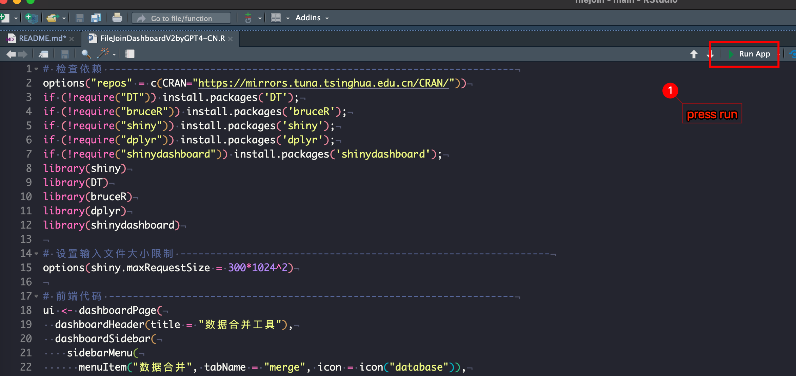
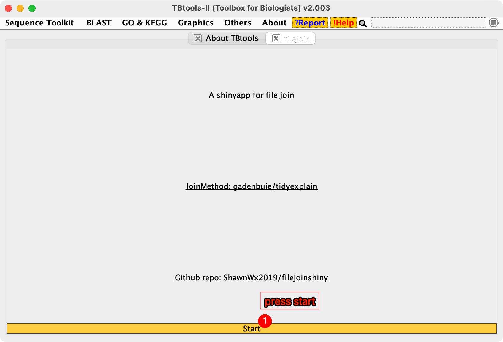
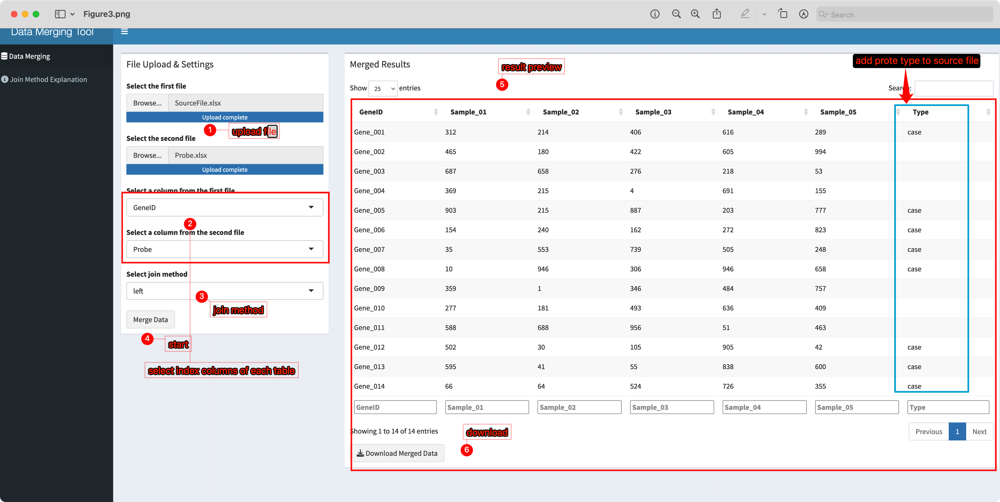
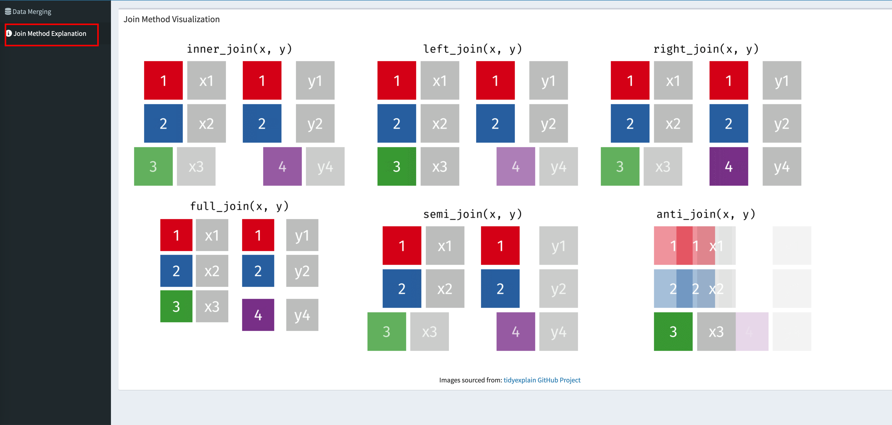

# FileJoinShiny

A ShinyApp for file join by dplyr

[](https://www.r-project.org) [](https://www.yuque.com/cjchen/hirv8i/fzc4g9)  [](https://opensource.org/licenses/MIT) [](http://www.shawnlearnbioinfo.top/)

# Getting started

------------------------------------------------------------------------

R version: `>4.1.1`

OS: `MacOS > 10.10`, `Win 7-11`, `linux must have a graphic interface`

## started with R or Rstudio

**In terminal**

```         
Rscript FileJoinDashboardV2byGPT4-CN.R
```

**In Rstudio**



------------------------------------------------------------------------

## started with TBtools plugin

------------------------------------------------------------------------

Step1. Installed from plugin store

Step2. Run app



## Step by Step

------------------------------------------------------------------------

**Soure file demo**

| GeneID   | Sample_01 | Sample_02 | Sample_03 | Sample_04 | Sample_05 |
|----------|-----------|-----------|-----------|-----------|-----------|
| Gene_001 | 312       | 214       | 406       | 616       | 289       |
| Gene_002 | 465       | 180       | 422       | 605       | 994       |
| Gene_003 | 687       | 658       | 276       | 218       | 53        |
| Gene_004 | 369       | 215       | 4         | 691       | 155       |
| Gene_005 | 903       | 215       | 887       | 203       | 777       |
| Gene_006 | 154       | 240       | 162       | 272       | 823       |
| Gene_007 | 35        | 553       | 739       | 505       | 248       |
| Gene_008 | 10        | 946       | 306       | 946       | 658       |
| Gene_009 | 359       | 1         | 346       | 484       | 757       |
| Gene_010 | 277       | 181       | 493       | 636       | 409       |
| Gene_011 | 588       | 688       | 956       | 51        | 463       |
| Gene_012 | 502       | 30        | 105       | 905       | 42        |
| Gene_013 | 595       | 41        | 55        | 838       | 600       |
| Gene_014 | 66        | 64        | 524       | 726       | 355       |

------------------------------------------------------------------------

**Probe file demo**

| Probe    | Type    |
|----------|---------|
| Gene_001 | case    |
| Gene_005 | case    |
| Gene_006 | case    |
| Gene_007 | case    |
| Gene_008 | case    |
| Gene_012 | case    |
| Gene_013 | case    |
| Gene_014 | case    |
| Gene_015 | case    |
| Gene_016 | case    |
| Gene_017 | control |
| Gene_018 | control |
| Gene_019 | control |
| Gene_020 | control |
| Gene_021 | control |
| Gene_022 | control |
| Gene_023 | control |
| Gene_024 | control |
| Gene_025 | control |
| Gene_026 | control |
| Gene_027 | control |
| Gene_028 | control |
| Gene_029 | control |
| Gene_030 | control |

------------------------------------------------------------------------

**start your job**



------------------------------------------------------------------------

## Join method help

------------------------------------------------------------------------


